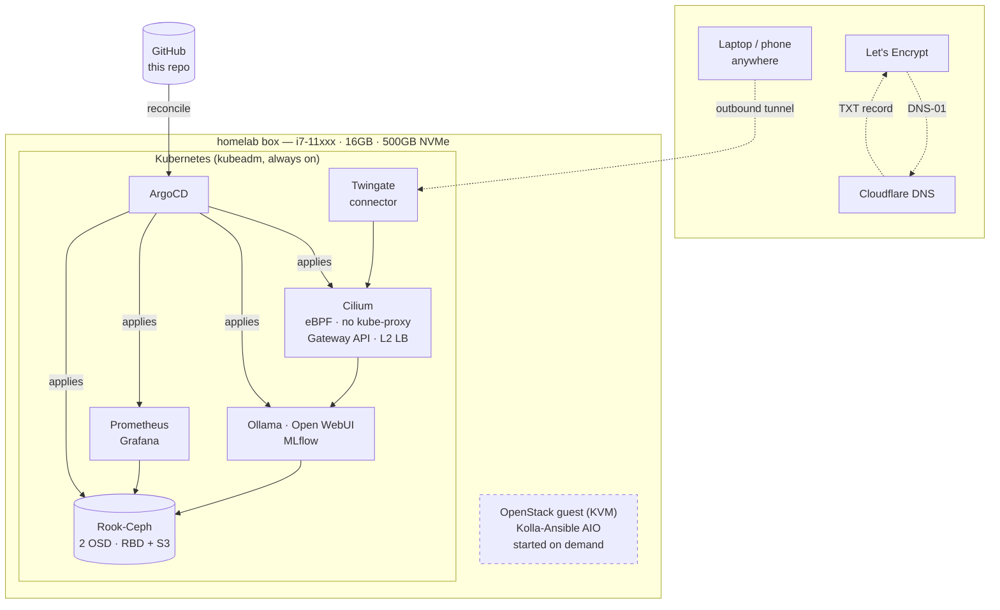

# homelab

A single-node private cloud on one 16GB box: Kubernetes for containers,
OpenStack for VMs, everything deployed by GitOps.

Built as an AI-infrastructure learning project. The interesting constraint is
that the whole platform — CNI, distributed storage, GitOps, observability,
zero-trust access, and model serving — has to fit in 16GB of RAM alongside an
OpenStack control plane. Most of the decisions in
[`docs/decisions.md`](docs/decisions.md) fall out of that.

## Architecture



**No inbound ports are open on the router.** The Twingate connector dials out;
Let's Encrypt validates via a DNS TXT record rather than an inbound HTTP
challenge.

## The RAM budget

This table is the design. Everything else follows from it.

| Component | Budget | Note |
|---|---:|---|
| Ubuntu + containerd + kubelet | 1.2 GB | |
| Control plane (apiserver/etcd/cm/sched) | 1.1 GB | apiserver dominates |
| Cilium agent + operator | 0.5 GB | replaces CNI + kube-proxy + MetalLB + ingress |
| Hubble relay + UI | 0.3 GB | parked in OpenStack mode |
| CoreDNS | 0.1 GB | |
| Rook: mon(1) + mgr(1) | 1.0 GB | one mon, deliberately |
| Rook: 2 × OSD | 3.0 GB | `osd_memory_target` pinned to 1.5GiB (default is 4) |
| Rook: RGW (S3) | 0.5 GB | |
| ArgoCD | 0.6 GB | |
| cert-manager + sealed-secrets | 0.2 GB | |
| Twingate connector | 0.1 GB | |
| kube-prometheus-stack | 1.8 GB | 7d retention, 30s scrape |
| **Platform total** | **~10.4 GB** | |
| **Free for workloads** | **~5.5 GB** | fits a 3B Q4 model + the web UI |

In OpenStack mode, `scripts/openstack-mode.sh` parks observability, Hubble,
ArgoCD and RGW and drops the OSD memory target, freeing ~4GB for the guest.
The API server, CNI, DNS and storage stay up — the cluster never goes dark.

## Layout

```
host/          bare-metal prep + kubeadm init + Cilium   (imperative, run once)
bootstrap/     ArgoCD install + the app-of-apps root     (imperative, run once)
clusters/lab/  everything else                            (GitOps, wave-ordered)
  infra/         sealed-secrets, cert-manager, rook-ceph
  platform/      gateway, split-horizon DNS, twingate, observability
  workloads/     ollama, open-webui, mlflow
scripts/       configure.sh, openstack-mode.sh, k8s-mode.sh
docs/          RUNBOOK.md (full build guide), decisions.md, versions.md
```

## Build it

Full step-by-step: **[`docs/RUNBOOK.md`](docs/RUNBOOK.md)**. Short version:

```bash
# 0. on the box, at the keyboard
./host/phase0-prep.sh
./host/wipe-ceph-disks.sh /dev/nvme0n1p4 /dev/nvme0n1p5

# 1. fill in your values, then bake them into the manifests
vim homelab.env && ./scripts/configure.sh
git commit -am "configure for my network" && git push

# 2. cluster + CNI
./host/phase1-cluster-init.sh

# 3. hand the cluster to Git
kubectl create namespace argocd
kubectl apply -n argocd -f https://raw.githubusercontent.com/argoproj/argo-cd/stable/manifests/install.yaml
kubectl apply -f bootstrap/root-app.yaml
```

Then seal the two secrets (`infra/cert-manager/SEALING.md`,
`platform/twingate/SEALING.md`) and Argo brings up the rest in wave order.

> **Before the first sync, read [`docs/versions.md`](docs/versions.md)** and
> verify every pinned chart version. They were written from memory.

## Status

- [ ] Phase 0 — host prep
- [ ] Phase 1 — kubeadm + Cilium
- [ ] Phase 2 — ArgoCD / GitOps
- [ ] Phase 3 — Rook-Ceph
- [ ] Phase 4 — DNS, TLS, Twingate
- [ ] Phase 5 — observability
- [ ] Phase 6 — AI workloads
- [ ] Phase 7 — OpenStack (Kolla-Ansible)
- [ ] Phase 8 — writeup
